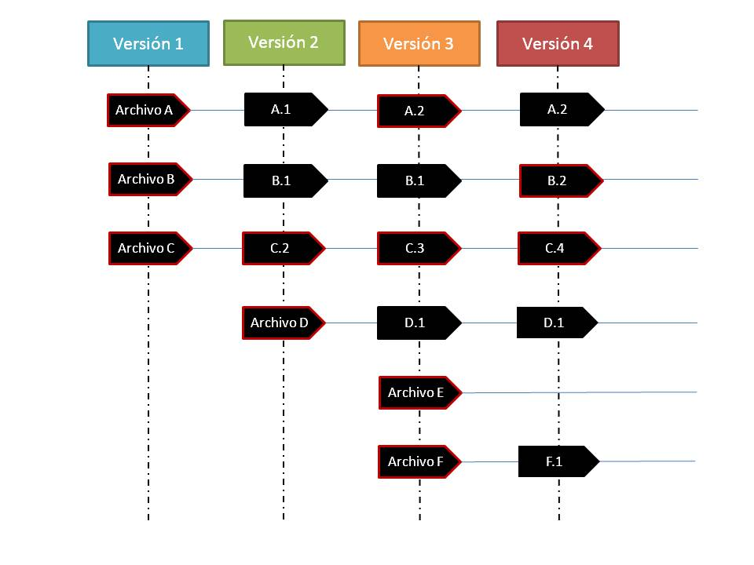
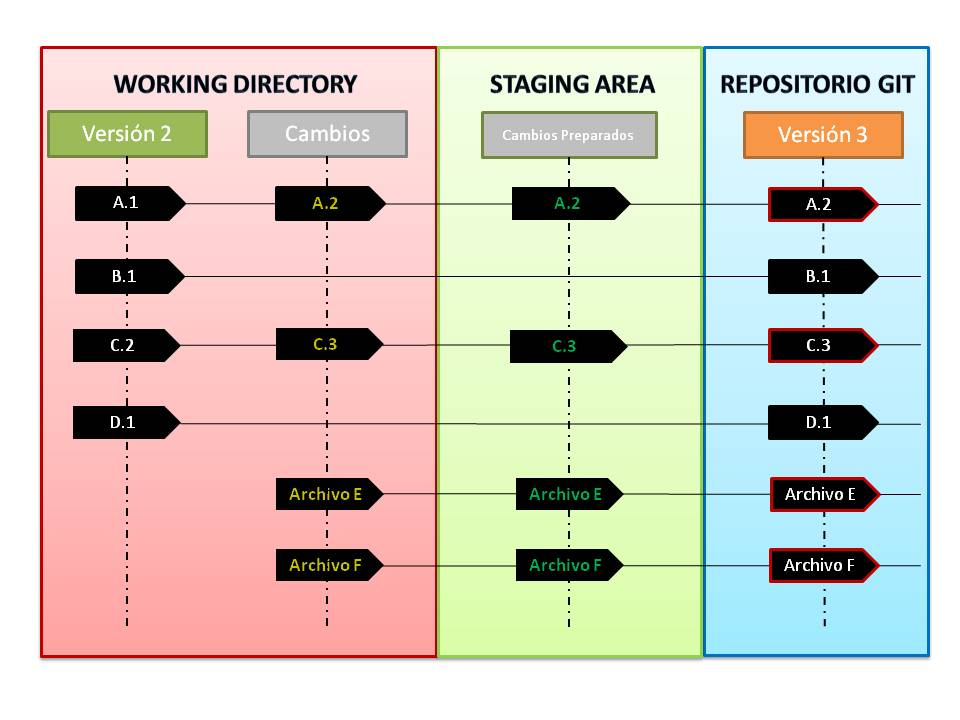
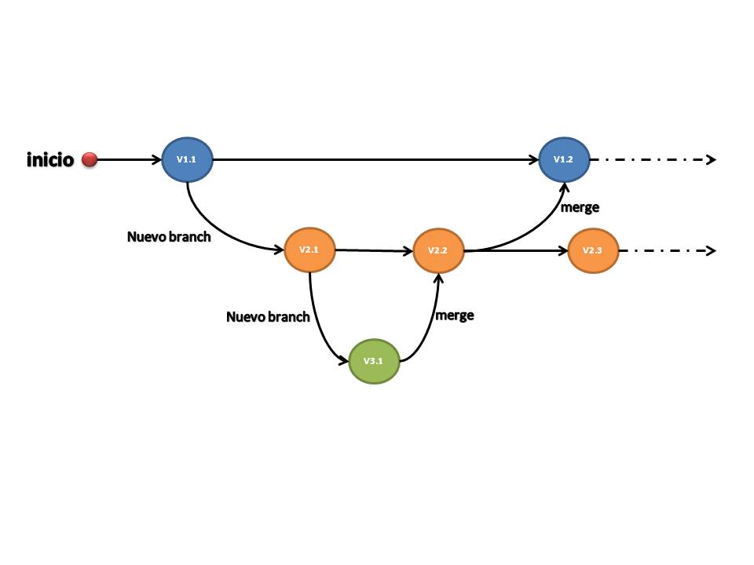
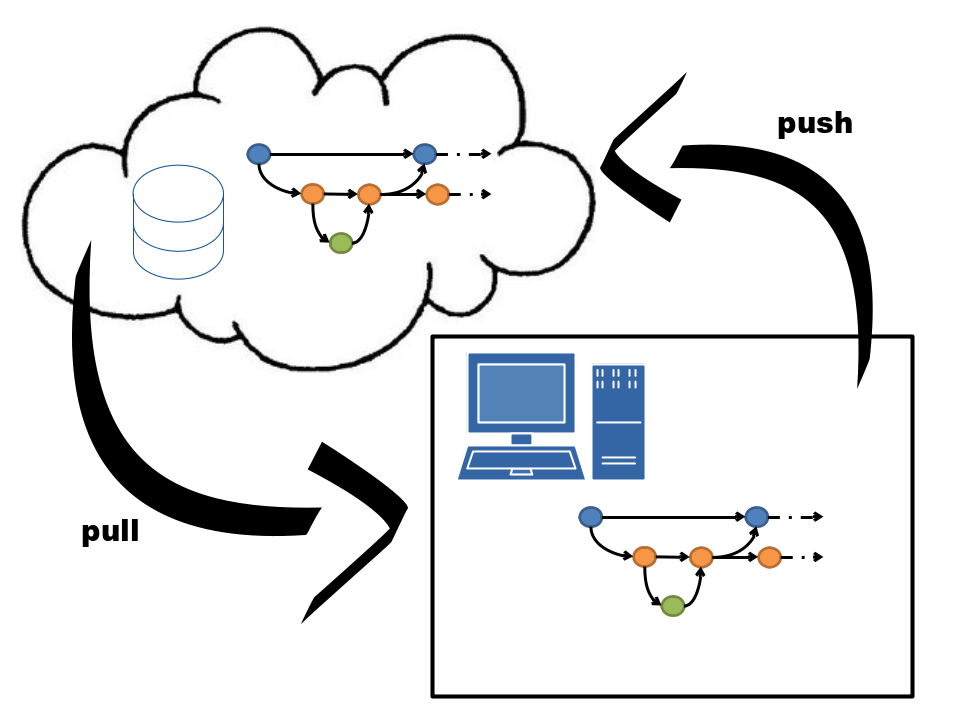

# Git y GitHub

## ¿Por qué hacer uso de Git y GitHub?

El rápido crecimiento de la industria del software, ha permitido el desarrollo de herramientas que facilitan muchas de las tareas para la gestión de un proyecto. Sin tales herramientas el desarrollo de un proyecto, sobre todo cuando en él se involucran muchas personas, se vería comprometido. Cuando en un proyecto se mantiene una gran cantidad de archivos, para mantener con seguridad el trabajo realizado y que el equipo involucrado trabaje sobre ellos de forma colaborativa sin inconvenientes, se han desarrollado diferentes sistemas conocidos como: sistemas de gestión de control de versiones.

Git figura como un sistema de control versiones, que goza de gran popularidad, debido a que marca un paradigma notablemente diferente respecto a otros sistemas de control de versiones. GitHub por su lado, es una herramienta diseñada para la gestión de proyectos colaborativos en la web que integra a Git como una de sus herramientas principales, permitiendo que personas de diferente latitudes del planeta puedan trabajar en proyectos a gran escala. GitHub se ha convertido en uno sitios con mayor número de repositorios y herramienta preferida para desarrolladores y científicos.

Como se ha mencionado Git y GitHub no son las únicas herramientas para realizar las tareas descritas, sin embargo, porque gozan de una gran popularidad y utilidad es importante aprender a trabajar con ellas.

## Git como sistema de control de versiones

Git nace a raíz de la necesidad de un software para continuar con el desarrollo del kernel de linux por la comunidad, alrededor del año 2005. La comunidad de linux en el desarrollo del nuevo software, sistema de control de versiones, buscó y consiguó las siguientes características:
- Velocidad
- Diseño sencillo
- Soporte para un desarrollo de trabajo no lineal
- Sistema de control distribuido
- Capacidad de manejar proyectos a gran escala

Git se puede considerar como una base de datos que mantiene instantáneas del conjunto de archivos del proyecto en cada versión de este, lo que permite que se pueda recuperar la forma de un proyecto en una versión específica. Por ello Git es útil cuando han ocurrido diversos errores y no hay forma fácil de solucionar, además, mantiene características con los que es posible integrar el trabajo hecho por muchas personas sobre un mismo conjunto de archivos. A continuación, se ilustra cómo Git mantiene las versiones de un proyecto con el tiempo.

En cada versión del proyecto se almacena el conjunto de archivos, si uno de ellos no es modificado y nuevo (señalado con el borde rojo) se mantiene una referencia directa del archivo con la versión anterior.

### Git para trabajo local

La base de datos de git se mantiene de forma local en cada repositorio del disco duro que se desee. Para crear la base de datos de git, y por ende el directorio git, desde la consola ubicado en el directorio deseado, se ejecuta:
~~~bash
$ git init
~~~
Con ello se genera dentro el directorio actual, otro directorio oculto donde vive el repositorio git y la base de datos en formato comprimido. A partir de aquí se puede controlar las versiones del proyecto, que se encuentra en el directorio donde el repositorio y la base de datos git fueron creados, usando todas las herramientas y funcionalidades que Git ofrece.

Por ahora el trabajo se mantiene de forma local, ya que para trabajar en equipo, se necesita de un servidor para comunicar a los diferentes miembros que colaboran en el proyecto. Aquí se justifica el uso de GitHub como herramienta, ya que puede considerarse como el "servidor" para el equipo que  lo utiliza, porque el repositorio y la base de datos git vive de forma remota.

### Áreas de trabajo en Git

Para un fácil manejo de los archivos modificados y las diferentes versiones del proyecto, se concibe que los archivos pasan por tres estados:
- Sin rastrear: El archivo no ha estado presente en ninguna de las versiones del proyecto, en otras palabras, es un nuevo archivo.
- Modificado: El archivo difiere del almacenado en el repositorio.
- Preparado: El archivo modificado está preparado para ser confirmado y por ende para ser guardado en el repositorio el archivo modificado.
- Confirmado: El archivo ya ha sido almacenado en el repositorio git (de ahora en más llamado repositorio solamente).

A los estados posibles del archivo, se añade, que en Git existen tres estaciones o secciones de trabajo:
- Working Directory (Directorio de trabajo)
- Staging Area (Área de ensayo)
- Repositorio Git (Almacenamiento de las diferentes versiones del proyecto)

El diagrama anterior puede ser usado para explicar un flujo de trabajo básico en Git. En primer lugar, cada conjunto de archivos que han sido modificados y posteriormente confirmados se constituye en una nueva versión del proyecto. Por esta razón de la imagen anterior, la versión 2 del proyecto es un conjunto de archivos ya confirmados y que ha sido traído al directorio de trabajo para modificarlo. A continuación la explicación del flujo básico de trabajo, proceso que es repetido cuantas veces sea necesario para completar el proyecto:
1. En el directorio de trabajo se modifican los archivos de la versión 2 (A.1, C.3)  y se agregan nuevos (Archivo E, Archivo F). En este punto, los archivos poseen el estado modificado y sin rastrear respectivamente.
2. Cuando los archivos han sido modificados, cada uno de ellos se agregan al área staging, En este punto, los archivos poseen el estado preparado. El comando para hacerlo es:
~~~bash
$ git add <nombre_archivo>
~~~
Si se desea agregar todo el conjunto de archivos en el working directory se  ejecuta el comando:
~~~bash
$ git  add .
~~~
3. Cuando los archivos se encuentran el área staging y se confirman los cambios, los archivos pasan al repositorio, creando una nueva versión del proyecto. El comando para confirmar los cambios es:
~~~bash
$ git commit -m "<mensaje>"
~~~
El objetivo del mensaje es dar una descripción precisa de los cambios realizados, ello ayudará en el futuro a recordar aspectos claves de la versión del proyecto que se está creando.

### Bifurcando el trabajo

 Con Git es posible mantener en paralelo múltiples versiones del proyecto, esta es una de las características que lo hace poderoso. Lo anterior significa que el desarrollo del proyecto no es lineal. El concepto detrás de la características mencionada es "branch" o rama en español. Más allá de ello, es posible incluso fusionar versiones, mediante el proceso llamado "merge".

Un branch es una versión del proyecto, que inicia a partir de una versión específica. En la imagen se observa que en el flujo de trabajo han existido tres ramas:
- La primera rama lo constituyen los nodos de color azul
- La segunda rama está constituido por los nodos de color anaranjado
- La tercera rama está representada por el único nodo color verde

El conjunto de nodos es conocido como el árbol de confirmaciones, ya que está constituido por todas las versiones del proyecto que son cambios confirmados. De la imagen se observa que, la segunda rama es creada a partir una versión (V1.1) de la primera rama, para hacerlo, al directorio de trabajo se trae la versión a partir de la cual se crea la rama y se ejecuta el siguiente comando:
~~~bash
$ git checkout -b  <nombre_rama_2>
~~~
Con ello, el proyecto ha sido bifurcado por la creación de una nueva rama y en el directorio de trabajo (dentro de la rama nueva) se ha hecho una copia de la versión del proyecto a partir del cual se ha creado la rama. Ahora, pueden hacerse cambios al conjunto de archivos del proyecto y luego confirmarlos, al hacerlo obtenemos otra versión (V2.1) del proyecto que es completamente independiente de la versión del
cual partimos.

El proceso anterior puede ser repetido, conforme al número de ramas que se necesiten. En la imagen se observa que a partir de la versión (V2.1) se crea una nueva rama, que da origen a la versión (V3.1) del proyecto. A continuación, surge la pregunta: ¿cómo puedo llevar a la rama 2 los cambios hechos en la versión (V3.1)? la respuesta es fusionar las ramas.

Para hacer la fusión, se trae al directorio de trabajo la última versión de la rama 2 con el comando:
~~~bash
$ git checkout <nombre_rama_2>
~~~
Luego se ejecuta el comando que realiza la fusión de las ramas:
~~~bash
$ git merge <nombre_rama_3>
~~~
Después de ejecutar el comando, en la segunda rama se crea una nueva versión (V2.2) del proyecto, que contiene lo realizado en la versión (V2.1) y (V3.2) de forma combinada. En la imagen también se observa que se hace una fusión entre la primera y segunda rama, combinando las versiones (V1.1) y (V2.2) del proyecto y creando la versión (V1.2).

Cuando una de las ramas ya no se necesita, como en el caso de la tercera rama, esta puede ser eliminada mediante el comando:
~~~bash
$ git branch -d <nombre_rama_3>
~~~
En caso de error, por existir cambios que no han sido fusionados con ningún otra rama, se puede forzar el borrado cambiando la "d" por "D" en el comando anterior.

## Uso de GitHub

Como se había mencionado, para hacer trabajo colaborativo es necesario que exista comunicación entre las máquinas de los miembros del equipo, popularmente se hace uso de los servidores para realizar esta tarea. Cuando se realiza trabajo colaborativo se debe establecer un flujo de trabajo que se acomode de forma efectiva al proyecto y al equipo, en este punto existen numerosas arquitecturas. GitHub es una herramienta que ofrece la posibilidad de mantener repositorios (directorios completos de proyectos) en la nube ya sea de forma pública o privada, lo que permite mantener las siguientes características:
- Compartir proyectos con muchas personas, aprovechando que Git es un sistema distribuido.
- Trabajar en un ambiente colaborativo.
- Aprovechar todas las bondades de Git.
- Mantener entornos y reducir errores.

Además, GitHub  ofrece herramientas propias como:
- **Wiki:** Es un sistema que permite documentar el proyecto o repositorio de forma más completa que el archivo Readme incluido en la mayoría de los proyectos.
- **Issues:** Es un sistema de seguimiento de errores en el proyecto, permite que las personas que tengan acceso al repositorio puedan: advertir errores y sugerir mejoras u optimiazaciones al proyecto.
- **Revisión de código:** Es una herramienta que permite realizar comentarios a partes del código contenido en el repositorio.
- **Visor de ramas:** Es una herramienta que permite visualizar las diferentes líneas de evolución del proyecto, además de manejarlas de forma gráfica.
- **Pull Request:** Es una forma de proteger la rama principal del proyecto, de modo que cada confirmación realizada a la rama principal pasa primeramente por un proceso de revisión, antes de finalmente aceptar los cambios entrantes.
- **Manejo de proyectos:** GitHib ofrece la posibilidad de crear un tablero canvas  para planificar el proyecto y administrar su manejo.

### GitHub y repositorio Git remoto

Desde la perspectiva de un usuario un repositorio Git puede vivir de forma remota o local. Considerando como repositorio Git local, el directorio dentro del disco de la computadora donde el usuario trabaja. De este modo cualquier repositorio Git que vive en otra computadora o en un servidor, se convierte en un repositorio remoto. La principal razón para tener repositorios remotos es abrir la posibilidad de mantener una copia del repositorio en local para trabajar, teniendo la posibilidad de agregar cambios al repositorio remoto y mantener actualizado el local.

GitHub permite mantener repositorios Git en la nube y por lo tanto remotos, al ser repositorios Git existen comandos mediante el cual se pueden comunicar los repositorios locales con los remotos. Para ello, dentro del repositorio local se añaden los repositorios remotos (identificados con un nombre), usando el comando:
~~~bash
$ git remote add <nombre_repositorio_remoto> <url_https/ssh>
~~~

La "url" del comando anterior se obtiene desde GitHub, una vez se ha creado el repositorio desde la cuenta de GitHub; lo anterior si el repositorio es personal, de lo contrario será proporcionado por el ente que corresponde. Otra manera de iniciar la comunicación entre el repositorio local del proyecto y el remoto, es clonar el repositorio GitHub, ejecutando el siguiente comando:
~~~bash
$ git clone <url_https/ssh>
~~~

El comando anterior configura por defecto el nombre del repositorio remoto como "origin" y por convención es el más usado. Cuando ya se configura el origen remoto de datos en el repositorio local, se pueden mandar cambios al repositorio en la nube haciendo un "push" o actualizar el repositorio local con un "pull", tal como se muestra en la imagen.

Pull es un comando que realiza dos acciones dentro del repositorio local. En primer lugar realiza un fetch, es decir, trae del repositorio remoto la última confirmación activa, por lo que es posible la versión que trae difiera del repositorio local. La segunda acción que realiza es un merge, de esta forma se combina el repositorio remoto con el local actualizándolo. El comando para hacer un pull es:
~~~bash
$ git pull <nombre_repositorio_remoto> <nombre_rama>
~~~

Push es un comando con el cual se puede enviar al repositorio remoto los cambios deseados y realizados en repositorio local. El comando para hacer push es:
~~~bash
$ git push <nombre_repositorio_remoto> <nombre_rama>
~~~
Como se puede observar en los comando anteriores, tanto para hacer pull y push se especifica el nombre de una rama. Lo anterior significa que debe existir una "conexión" entre el repositorio local y remoto, de forma que exista dentro del repositorio local las ramas con las que se desean trabajar del repositorio remoto.

### Trabajando con repositorios remotos

Cuando se trabajan con repositorios remotos se debe tener mucho cuidado con las acciones que se realizan, siendo este el punto donde ocurren la mayor parte de los problemas al trabajar con estas herramientas. Para evitar inconvenientes, sobre todo para principiantes, se recomienda el siguiente flujo de trabajo para iniciar a utilizar GitHub:
- Crear en GitHub el repositorio y establecer las ramas con la cuales se estarán trabajando.
- Clonar el repositorio en el directorio deseado de la máquina donde se trabajará.

Siguiendo el esquema anterior se podrá dar comienzo al trabajo con un mínimo de esfuerzo y se tendrán las ramas necesarias para trabajar tanto en el repositorio local como en el remoto. Por supuesto se pueden crear ramas adicionales tanto en el repositorio remoto como local, pero para que sean visibles entre los repositorios se deben realizar pasos adicionales.

Para obtener el máximo potencial de Git y GitHub se describen las siguientes buenas prácticas:
- Lo más recomendable es realizar pull (actualizar repositorio local) antes de hacer un push (enviar cambios al repositorio remoto), ello permitirá mantener un buen orden y con el menor número de conflictos entre los repositorios.
- Cada vez que se haga un commit se debe dejar un mensaje descriptivo de las confirmaciones que se están haciendo.
- Es recomendable mantener una rama principal (en GitHub por defecto se conoce como master/main) en el cual solo existan confirmaciones con las versiones oficiales del proyecto, de este modo cualquier: resolución de conflictos, problemas o añadido de características, se trabaja en una rama diferente a la principal. El esquema anterior permite mantener una versión limpia del proyecto que se realiza y la evolución del mismo.
- Git está pensado para trabajar con texto plano, por lo que no es recomendable almacenar archivos binarios en el repositorio Git.

## Resumen de Comandos

A continuación se describen comandos útiles al momento de trabajar con repositorios Git

| COMANDO                                                     | DESCRIPCIÓN |
|-------------------------------------------------------------|-------------|
| git init                                                    | Para iniciar un repositorio Git.       |
| git config --global user.name <nombre_usuario>              | Para configurar de manera global (todo repositorio Git dentro de la computadora) el nombre del usuario|
| git config --global user.email <correo_usuario>             | Para configurar de manera global (todo repositorio Git dentro de la computadora) el email del usuario|
| git status                                                  | Para visualizar el estado de los archivos en el directorio de trabajo (working_directory)|
| git add <nombre_archivo\|.>                                  | Para agregar un archivo específico al área de staging (<nombre_archivo>) o para agregar todos los archivos del working_directory (<.>) al área de staging|
| git commit -m "mensaje"                                   | Para confirmar el conjunto de archivos nuevos que se encuentran en el área de staging, resultando (después de ejecutar) en una nueva versión del proyecto|
| git checkout <nombre_rama>                                  | Para cambiar entre ramas o navegar por el árbol de confirmaciones|
| git branch                                                  | Para visualizar la lista de ramas creadas en el repositorio local|
| git branch -r                                               | Para visualizar la lista de ramas creadas en el repositorio remoto|
| git branch <nombre_rama>                                    | Para crear una nueva rama en el repositorio local|
| git checkout -b <nombre_rama>                               | Comando que se usa para  realizar dos acciones en una: crear y cambiarse de rama|
| git pull <nombre_repositorio_remoto> <nombre_rama>          | Comando que se usa para: traer al repositorio local lo que se encuentra en el remoto haciendo merge entre las ramas de los repositorios|
| --allow-unrelated-histories                                 | Es un modificador del comando "git pull .." o "git merge", usado para hacer merge entre dos ramas o repositorios que no tienen historias relacionadas o comunes|
| git push <nombre_repositorio_remoto> <nombre_rama>          | Para enviar un conjunto de modificaciones del repositorio local al remoto|
| git remote add <nombre_repositorio_remoto> <url_https\|ssh> | Comando usado para agregar un repositorio remoto con el cual se puede comunicar el repositorio local|
